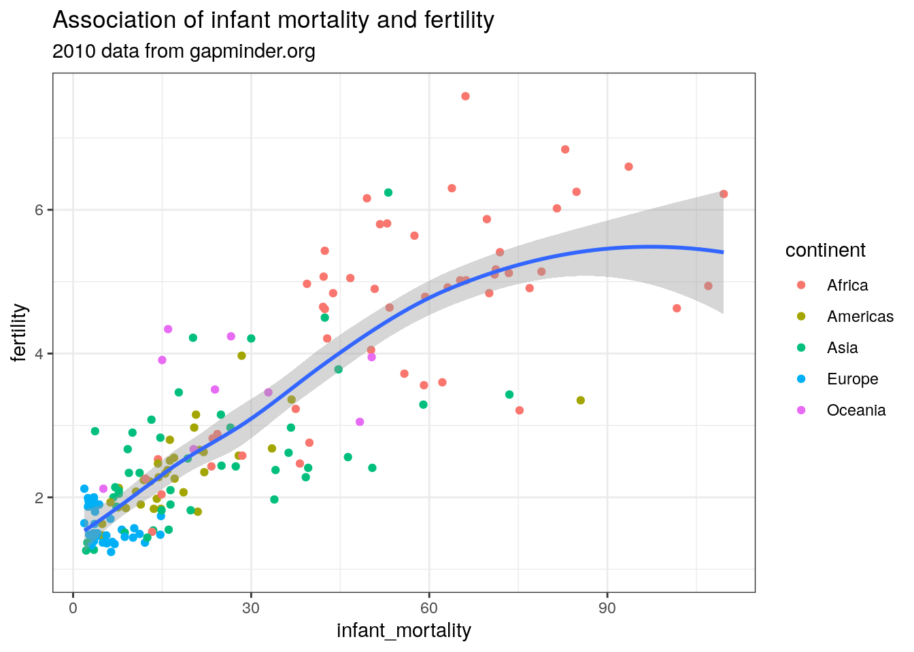
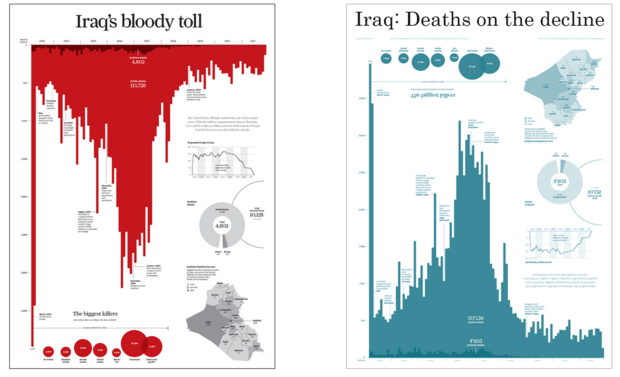

# Data visualisation

Being able to look at the data is a key step in data exploration, during the analysis and in the communication of results. R has a range of powerful tools to create graphs quickly, and then to develop them into a publication-ready format where helpful.

For an introduction to the Grammar of Graphics and ggplot2, the package that we will be using for visualisation, watch this video:

<iframe src=" https://www.youtube.com/embed/sk7TT5qM5Hw?rel=0&modestbranding=1&loop=1&playlist=sk7TT5qM5Hw " allowfullscreen width=80% height=350></iframe>

[Click here](https://drive.google.com/open?id=1UGp7own42PkPv-TLbX29sQUu2DfeaMUp) for the code used in the video


## `ggplot2`

We use the `ggplot2`-package because it offers a consistent way to create anything from simple exploratory plots to complex data visualisation. Each graph command needs certain parts:

* a call to the `ggplot`-function and the **data** as the first argument: `ggplot(gapminder, `
* a mapping of the **aesthetics**, i.e. of variables to visual elements. This uses the `aes`-function that is given to `ggplot` as the second argument: `aes(x=infant_mortality, y=fertility, col=continent))` (Note that two closing brackets are needed as this also completes the ggplot function call)
* a **geometry**, i.e. a type of chart, that is added with a plus-symbol and the function call, e.g., `+ geom_point()`
* optional elements such as labels that are included again with plus-symbols and function calls, e.g., `+ labs(title = "Association of infant mortality and fertility", subtitle="2010 data from gapminder.org")`

Multiple geometries can be layered on top of each other, for example to add trend lines to scatterplots. In that case, `aes()` functions can be included into the `geom_x()`-functions to make some of the mappings specific to certain geometries. This is done in the example below to color the points by continent without applying that aestethic to the line - if it was included in the main `aes()`-function, the plot would contain a separate coloured line for each continent. 

*Note:* Line breaks are completely up to you and can be used to make the code readable as long as the command does not appear complete too early - to keep it simple, there should always be an open bracket, a comma or a + before a line break within the command to create a ggplot-chart


```r
pacman::p_load(dslabs, dplyr, ggplot2)
gapminder2010 <- gapminder %>% filter(year==2010)

ggplot(gapminder2010, aes(x=infant_mortality, y=fertility)) +
  geom_point(aes(col=continent)) + geom_smooth() +
    ggtitle("Association of infant mortality and fertility", 
            subtitle="2010 data from gapminder.org")
```

```
## Warning: Removed 7 rows containing non-finite values (stat_smooth).
```

```
## Warning: Removed 7 rows containing missing values (geom_point).
```

<div class="figure" style="text-align: center">

<p class="caption">(\#fig:ggplot-example)A simple ggplot example</p>
</div>

## `esquisse`: using ggplot2 with your mouse

The `esquisse` package provides an RStudio add-in that lets you create `ggplot2`-charts interactively, without having to know the code in advance. If that sounds You can check out the [Getting Started guide](https://dreamrs.github.io/esquisse/articles/get-started.html){target="_blank"} to see what that would look like. To try it out, run `install.packages("esquisse")`, load the data you want to use, and type `esquisse::esquisser()` into your Console.

Try not to rely on `esquisse` *instead of* `ggplot2` - the aim in this module is to learn how to write code that is reproducible, not how to click boxes. However, `esquisse` shows you the code it generates (check `Export & Code` at the bottom right), so that it can be very helpful when you are getting started, or when you are not quite sure how to do something.

## Opinionated visualisation

It is easy to find examples of misleading charts that should never have been published. However, even when all the elements of a chart are legitimately presented, the same data can still be used to suggest radically different conclusions. See the following example and follow the source link to read more about "opinionated" data visualisations. Apart from being critical when seeing charts, the take-away message from this is to be conscious of the power of small design choices - that is a power you should wield consciously when creating charts. 

<div class="figure" style="text-align: center">

<p class="caption">(\#fig:two-messages)Same data, two messages (Source: <a href="https://www.infoworld.com/article/3088166/why-how-to-lie-with-statistics-did-us-a-disservice.html">infoworld.com</a>)</p>
</div>

## Further resources {#further-resources-visualisation}

* The [R Graphics Cookbook](https://r-graphics.org/){target="_blank"} by Winston Chang is available online with 150 "recipes" that cover everything from basic exploratory charts to colour-coded maps.
* The BBC graphics team has published their own [R Cookbook](https://bbc.github.io/rcookbook/){target="_blank"} with many tips for making charts that convey a clear message, as well as some custom functions for making clean publication-ready charts.
* Irizarry's *Introduction to Data Science* has a good chapter on [data visualisation principles](https://rafalab.github.io/dsbook/data-visualization-principles.html){target="_blank"}
* I am a big fan of the gapminder bubble chart. In the video (from about 5:00), I show how to create a static version, but R can also create the dynamic version that shows global development over time. For that, you can `<a href="data:text/plain;base64,CiNwYWNtYW4gb2ZmZXJzIGFuIGVhc3kgc2hvcnRjdXQgdG8gcmVwbGFjZSBpbnN0YWxsLnBhY2thZ2VzKCkgYW5kIGxpYnJhcnkoKQojTG9hZCBwYWNrYWdlcywgYWZ0ZXIgaW5zdGFsbGluZyB0aGVtIGlmIG5lY2Vzc2FyeS4KaWYgKCFyZXF1aXJlKCJwYWNtYW4iKSkgaW5zdGFsbC5wYWNrYWdlcygicGFjbWFuIikKcGFjbWFuOjpwX2xvYWQodGlkeXZlcnNlLCBnZ3Bsb3QyLCB2aXJpZGlzLCBnZ2FuaW1hdGUsIHdic3RhdHMsIHBuZywgZ2lmc2tpLCBtYWdpY2spCgojIGluc3RhbGwucGFja2FnZXMoInRpZHl2ZXJzZSIpCiMgaW5zdGFsbC5wYWNrYWdlcygiZ2dwbG90MiIpCiMgaW5zdGFsbC5wYWNrYWdlcygidmlyaWRpcyIpCiMgaW5zdGFsbC5wYWNrYWdlcygiZ2dhbmltYXRlIikKIyBpbnN0YWxsLnBhY2thZ2VzKCJ3YnN0YXRzIikKIyAKIyBsaWJyYXJ5KHRpZHl2ZXJzZSkKIyBsaWJyYXJ5KGdncGxvdDIpCiMgbGlicmFyeSh2aXJpZGlzKQojIGxpYnJhcnkoZ2dhbmltYXRlKQojIGxpYnJhcnkod2JzdGF0cykKCiMgcm9zbGluZyBjaGFydCBpbiBvbmUgY29tbWFuZAoKIyBwdWxsIHRoZSBjb3VudHJ5IGRhdGEgZG93biBmcm9tIHRoZSBXb3JsZCBCYW5rIC0gdGhyZWUgaW5kaWNhdG9ycwood2JzdGF0czo6d2IoaW5kaWNhdG9yID0gYygiU1AuRFlOLkxFMDAuSU4iLCAiTlkuR0RQLlBDQVAuQ0QiLCAiU1AuUE9QLlRPVEwiKSwgCiAgICAgICAgICAgIGNvdW50cnkgPSAiY291bnRyaWVzX29ubHkiLCBzdGFydGRhdGUgPSAxOTYwLCBlbmRkYXRlID0gMjAxOCkgICU+JSAKICAjIHB1bGwgZG93biBtYXBwaW5nIG9mIGNvdW50cmllcyB0byByZWdpb25zIGFuZCBqb2luCiAgZHBseXI6OmxlZnRfam9pbih3YnN0YXRzOjp3YmNvdW50cmllcygpICU+JSAKICAgICAgICAgICAgICAgICAgICAgZHBseXI6OnNlbGVjdChpc28zYywgcmVnaW9uKSkgJT4lIAogICMgc3ByZWFkIHRoZSB0aHJlZSBpbmRpY2F0b3JzCiAgdGlkeXI6OnBpdm90X3dpZGVyKGlkX2NvbHMgPSBjKCJkYXRlIiwgImNvdW50cnkiLCAicmVnaW9uIiksIG5hbWVzX2Zyb20gPSBpbmRpY2F0b3IsIHZhbHVlc19mcm9tID0gdmFsdWUpICU+JSAKICAjIHBsb3QgdGhlIGRhdGEKICBnZ3Bsb3QyOjpnZ3Bsb3QoYWVzKHggPSBsb2coYEdEUCBwZXIgY2FwaXRhIChjdXJyZW50IFVTJClgKSwgeSA9IGBMaWZlIGV4cGVjdGFuY3kgYXQgYmlydGgsIHRvdGFsICh5ZWFycylgLAogICAgICAgICAgICAgICAgICAgICAgc2l6ZSA9IGBQb3B1bGF0aW9uLCB0b3RhbGApKSArCiAgZ2dwbG90Mjo6Z2VvbV9wb2ludChhbHBoYSA9IDAuNSwgYWVzKGNvbG9yID0gcmVnaW9uKSkgKwogIGdncGxvdDI6OnNjYWxlX3NpemUocmFuZ2UgPSBjKC4xLCAxNiksIGd1aWRlID0gRkFMU0UpICsKICBnZ3Bsb3QyOjpzY2FsZV94X2NvbnRpbnVvdXMobGltaXRzID0gYygyLjUsIDEyLjUpKSArCiAgZ2dwbG90Mjo6c2NhbGVfeV9jb250aW51b3VzKGxpbWl0cyA9IGMoMzAsIDkwKSkgKwogIHZpcmlkaXM6OnNjYWxlX2NvbG9yX3ZpcmlkaXMoZGlzY3JldGUgPSBUUlVFLCBuYW1lID0gIlJlZ2lvbiIsIG9wdGlvbiA9ICJ2aXJpZGlzIikgKwogIGdncGxvdDI6OmxhYnMoeCA9ICJMb2cgR0RQIHBlciBjYXBpdGEiLAogICAgICAgICAgICAgICAgeSA9ICJMaWZlIGV4cGVjdGFuY3kgYXQgYmlydGgiKSArCiAgZ2dwbG90Mjo6dGhlbWVfY2xhc3NpYygpICsKICBnZ3Bsb3QyOjpnZW9tX3RleHQoYWVzKHggPSA3LjUsIHkgPSA2MCwgbGFiZWwgPSBkYXRlKSwgc2l6ZSA9IDE0LCBjb2xvciA9ICdsaWdodGdyZXknKSArCiAgIyBhbmltYXRlIGl0IG92ZXIgeWVhcnMKICBnZ2FuaW1hdGU6OnRyYW5zaXRpb25fc3RhdGVzKGRhdGUsIHRyYW5zaXRpb25fbGVuZ3RoID0gMSwgc3RhdGVfbGVuZ3RoID0gMSkpICU+JQogICMgT24gbXkgKEx1a2FzKSBjb21wdXRlciB0aGUgZ2lmIGRvZXMgbm90IHJlbmRlciBjb3JyZWN0bHkgdW5sZXNzIHRoaXMgbGluZSBpcyBhZGRlZAogIGFuaW1hdGUocmVuZGVyZXIgPSBtYWdpY2tfcmVuZGVyZXIoKSkKCgoK" download="gapminder_animated.R">check out this code</a>`{=html}.
  
