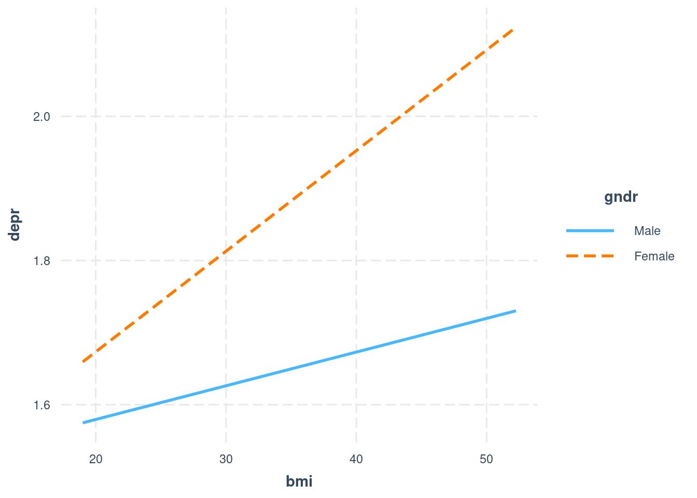

# Interaction terms in linear models

Watch this video for an introduction to interaction terms in linear models:

<iframe src=" https://www.youtube.com/embed/coyXicRccSg?rel=0&modestbranding=1&loop=1&playlist=coyXicRccSg " allowfullscreen width=80% height=350></iframe>

The section below essentially contains the code needed for the examples in the video, with some further annotations. Before that, just one note on terminology:

* Generally, if two variables interact, then the effect that one has on the predictor (the regression slope) depends on the value of the other. Mathematically, that relationship is symetrical - if A interacts with B, then B interacts with A.
* For interpretation, we often designate one of the variables as the *moderator*. That just means that we are primarily interested in the effect of the other variable on the outcome and in how the moderator changes that effect. Often, demographic variables such as age or gender serve as moderators. 

## Example 1: Memory and chess


The first example draws on research by Gobet & Simon (1996) but uses simulated data.


<div class='solution'><button>Show the code to simulate the data</button>


```r
library(tidyverse)

#Generate data (errors committed) - *roughly* based on Gobet & Simon 1996
set.seed(300688) #for reproducible results
ER <- rnorm(50, 4.9,3.5) + rnorm(50, 0, 2)
NR <- rnorm(50, 15.7, 4.0) + rnorm(50, 0, 2)
EF <- rnorm(50, 21.4, 5) + rnorm(50, 0, 2)
NF <- rnorm(50, 21.8, 5) + rnorm(50, 0, 2)

obs <- data.frame(player = "expert", type = "real", errors = ER) %>% 
  rbind(data.frame(player = "novice", type = "real", errors = NR)) %>%
  rbind(data.frame(player = "expert", type = "fake", errors = EF)) %>%
  rbind(data.frame(player = "novice", type = "fake", errors = NF)) %>% 
  mutate(type=factor(type), 
         player = factor(player, levels = c("novice", "expert")))

#Adding the centrally mirrored condition
EM <- rnorm(50, 7.8, 3.5) + rnorm(50, 0, 2)
NM <- rnorm(50, 18, 3.5) + rnorm(50, 0, 2)

obs2 <- data.frame(player = "expert", type = "real", errors = ER) %>% 
  rbind(data.frame(player = "novice", type = "real", errors = NR)) %>%
  rbind(data.frame(player = "expert", type = "fake", errors = EF)) %>%
  rbind(data.frame(player = "novice", type = "fake", errors = NF)) %>% 
  rbind(data.frame(player = "expert", type = "mirrored", errors = EM)) %>% 
  rbind(data.frame(player = "novice", type = "mirrored", errors = NM)) %>% 
  mutate(type=factor(type), 
         player = factor(player, levels = c("novice", "expert")))
```

</div>


The first model tests whether player level and position type interact. That is the case, based on the very small *p*-value of the interaction term. Then we use a plot to understand the nature of that interaction further - because the predictor is categorical, we use the `cat_plot()` function.


```r
pacman::p_load(tidyverse)
mod <- lm(errors ~ player + type + player:type, obs)
summary(mod)
```

```{.bg-none}
## 
## Call:
## lm(formula = errors ~ player + type + player:type, data = obs)
## 
## Residuals:
##      Min       1Q   Median       3Q      Max 
## -13.8157  -3.6637  -0.0812   3.6591  14.2213 
## 
## Coefficients:
##                       Estimate Std. Error t value Pr(>|t|)    
## (Intercept)            21.5744     0.7398  29.164  < 2e-16 ***
## playerexpert           -1.2240     1.0462  -1.170    0.243    
## typereal               -6.5092     1.0462  -6.222 2.91e-09 ***
## playerexpert:typereal  -8.0039     1.4795  -5.410 1.83e-07 ***
## ---
## Signif. codes:  0 '***' 0.001 '**' 0.01 '*' 0.05 '.' 0.1 ' ' 1
## 
## Residual standard error: 5.231 on 196 degrees of freedom
## Multiple R-squared:  0.5892,	Adjusted R-squared:  0.5829 
## F-statistic: 93.69 on 3 and 196 DF,  p-value: < 2.2e-16
```

```r
pacman::p_load(interactions)
cat_plot(mod, pred="player", modx = "type", geom="line")
```

<div class="figure" style="text-align: center">

<p class="caption">(\#fig:categorical-interaction-A)Simple interaction plot - note that lines are not parallel</p>
</div>
Next we consider a third condition - chess positions that are neither quite real nor entirely fake, but positions that are mirrored. With that, we get multiple dummy interaction terms. To test whether they are collectively significant, we need to use the `Anova()` function from the `car` package.


```r
mod <- lm(errors ~ player + type + player:type, obs2)
summary(mod)
```

```{.bg-none}
## 
## Call:
## lm(formula = errors ~ player + type + player:type, data = obs2)
## 
## Residuals:
##      Min       1Q   Median       3Q      Max 
## -13.8157  -3.3006  -0.0503   3.4305  14.2213 
## 
## Coefficients:
##                           Estimate Std. Error t value Pr(>|t|)    
## (Intercept)                21.5744     0.6881  31.354  < 2e-16 ***
## playerexpert               -1.2240     0.9731  -1.258    0.209    
## typemirrored               -4.6796     0.9731  -4.809 2.43e-06 ***
## typereal                   -6.5092     0.9731  -6.689 1.13e-10 ***
## playerexpert:typemirrored  -8.3088     1.3762  -6.038 4.71e-09 ***
## playerexpert:typereal      -8.0039     1.3762  -5.816 1.57e-08 ***
## ---
## Signif. codes:  0 '***' 0.001 '**' 0.01 '*' 0.05 '.' 0.1 ' ' 1
## 
## Residual standard error: 4.866 on 294 degrees of freedom
## Multiple R-squared:  0.6085,	Adjusted R-squared:  0.6018 
## F-statistic: 91.38 on 5 and 294 DF,  p-value: < 2.2e-16
```

```r
pacman::p_load(car)
car::Anova(mod, type=3)
```

```{.bg-none}
## Anova Table (Type III tests)
## 
## Response: errors
##              Sum Sq  Df  F value    Pr(>F)    
## (Intercept) 23272.7   1 983.0610 < 2.2e-16 ***
## player         37.5   1   1.5821    0.2095    
## type         1126.9   2  23.8013 2.627e-10 ***
## player:type  1109.9   2  23.4420 3.580e-10 ***
## Residuals    6960.1 294                       
## ---
## Signif. codes:  0 '***' 0.001 '**' 0.01 '*' 0.05 '.' 0.1 ' ' 1
```
An interaction plot can then help again to understand what is going on. Here it shows that two of the three conditions are very similar.


```r
cat_plot(mod, pred="player", modx = "type", geom="line")
```

<div class="figure" style="text-align: center">

<p class="caption">(\#fig:categorical-interaction-B)Simple interaction plot - now 2 lines are parallel</p>
</div>

## Example 2: link between obesity and negative emotions in the European Social Survey

In this example, I considered the link between obesity and negative emotions in Germany in the European Social Survey 2014. (Note that this relationship does not appear in the UK, which indicates that it should probably be treated as an interesting observation rather than a likely general relationship for now.)


<div class='solution'><button>Click here to see the code that loads and prepares the data</button>


```r
ess <- read_rds(url("http://empower-training.de/Gold/round7.RDS"))

pacman::p_load(psych) #Used to create a scale

a <- ess %>% select(cldgng, fltsd, enjlf, fltlnl, wrhpp, slprl, flteeff, fltdpr) %>% 
  haven::zap_labels() %>% 
  #This is sometimes needed when SPSS files have been imported with haven 
  #and errors related to data classes appear.
  psych::alpha(check.keys = TRUE)

ess$depr <- a$scores

ess$bmi <- ess$weight/((ess$height/100)^2)

#Filter for Germans with realistic BMI who are not underweight 
#and reported their gender
essDE <- ess %>% filter(bmi < 60, bmi>=19, gndr != "No answer", cntry=="DE")

#Data prep for example 3 - strip unnecessary labels
ess$stflife <- haven::zap_labels(ess$stflife)
```

</div>


The `lm()` output below shows that there is a significant interaction between gender and BMI, with women having a stronger relationship between BMI and the frequency of experiencing negative emotions. This is again shown in an interaction plot - as the predictor variable is continuous, we now use the `interact_plot()` function.


```r
pacman::p_load(interactions)
mod <- lm(depr ~ bmi + gndr + bmi:gndr, essDE)
summary(mod)
```

```{.bg-none}
## 
## Call:
## lm(formula = depr ~ bmi + gndr + bmi:gndr, data = essDE)
## 
## Residuals:
##      Min       1Q   Median       3Q      Max 
## -0.85559 -0.31936 -0.09363  0.25624  2.00783 
## 
## Coefficients:
##                 Estimate Std. Error t value Pr(>|t|)    
## (Intercept)     1.486028   0.072229  20.574   <2e-16 ***
## bmi             0.004674   0.002667   1.753   0.0797 .  
## gndrFemale     -0.091874   0.096134  -0.956   0.3393    
## bmi:gndrFemale  0.009284   0.003609   2.573   0.0101 *  
## ---
## Signif. codes:  0 '***' 0.001 '**' 0.01 '*' 0.05 '.' 0.1 ' ' 1
## 
## Residual standard error: 0.438 on 2860 degrees of freedom
##   (2 observations deleted due to missingness)
## Multiple R-squared:  0.037,	Adjusted R-squared:  0.03599 
## F-statistic: 36.63 on 3 and 2860 DF,  p-value: < 2.2e-16
```

(ref:int plot) `interact_plot()` shows different slopes for men and women. 


```r
interact_plot(mod, pred="bmi", modx = "gndr")
```

<div class="figure" style="text-align: center">

<p class="caption">(\#fig:interaction-plot-package)ref:int plot</p>
</div>

Note that `ggplot2` automatically includes an interaction when fitting regression lines as soon as a categorical variable is mapped to the `colour` (or `linetype`) aesthetic - so in simple cases, `geom_smooth(method = "lm")` can be used as an alternative to `interact_plot()`


```r
ggplot(essDE, aes(x=bmi, y=depr, colour=gndr)) + geom_smooth(method="lm", se=FALSE)
```

```
## Warning: Removed 2 rows containing non-finite values (stat_smooth).
```

<div class="figure" style="text-align: center">

<p class="caption">(\#fig:interaction-plot-ggplot)ggplot automatically includes interaction</p>
</div>

## Example 3: link between working hours, income and life satisfaction

This example considers whether working hours (`wkhtot`) affect the link between income (`hinctnta`) and life satisfaction - i.e. does working very long hours make income less valuable? This time, the effect appeared in the UK data in the 2014 European Social Survey - again, the question might be whether that is just an incident of spurious data mining, or whether it reveals a broader relationship.

In any case, let's have a look at the interaction. Note that `*` in the `lm()` formula is an abbreviation for `+` and `:`, so that the command below could also be written as `lm(stflife ~ wkhtot + hinctnta + wkhtot:hinctnta)`


```r
essUK <- filter(ess, cntry == "GB")
mod <- lm(stflife ~ wkhtot*hinctnta, essUK) 
summary(mod)
```

```{.bg-none}
## 
## Call:
## lm(formula = stflife ~ wkhtot * hinctnta, data = essUK)
## 
## Residuals:
##     Min      1Q  Median      3Q     Max 
## -7.9013 -0.9305  0.3023  1.3331  3.6527 
## 
## Coefficients:
##                  Estimate Std. Error t value Pr(>|t|)    
## (Intercept)      6.085338   0.242722  25.071  < 2e-16 ***
## wkhtot           0.008065   0.006235   1.293   0.1960    
## hinctnta         0.238197   0.043684   5.453 5.64e-08 ***
## wkhtot:hinctnta -0.002129   0.001055  -2.019   0.0437 *  
## ---
## Signif. codes:  0 '***' 0.001 '**' 0.01 '*' 0.05 '.' 0.1 ' ' 1
## 
## Residual standard error: 2.023 on 1810 degrees of freedom
##   (450 observations deleted due to missingness)
## Multiple R-squared:  0.05154,	Adjusted R-squared:  0.04997 
## F-statistic: 32.79 on 3 and 1810 DF,  p-value: < 2.2e-16
```

We can see that while income positively predicts life satisfaction, this effects appears to be weaker when both income and working hours are high. However, we need to be careful with interpretation here - technically, the coefficients for income and working hours now reflect the impact of that variable when the other variable is 0, and are thus unlikely to be meaningful. Therefore, it is better to look at the interaction plot and at simple slopes analyses. Both can now be done in two ways, depending on which variable we see as the primary predictor/variable of interest.


```r
interact_plot(mod, pred="hinctnta", modx = "wkhtot")
```

<div class="figure" style="text-align: center">

<p class="caption">(\#fig:simple-slopes-A)Option A: strong positive effect of income, tempered by working hours</p>
</div>


```r
interact_plot(mod, pred="wkhtot", modx = "hinctnta")
```

<div class="figure" style="text-align: center">

<p class="caption">(\#fig:simple-slopes-B)Option B: very different effects of working hours, depending on income</p>
</div>

Simple slopes analyses (`sim_slopes()`) offer similar information together with significance tests and thus help to decide which of the slopes should be interpreted. They contain the Johnson-Neyman interval, which is the range of values of the moderator for which the predictor has a significant effect on the outcome.


```r
pacman::p_load(interactions)
sim_slopes(mod, pred="hinctnta", modx = "wkhtot")
```

```{.bg-none}
## JOHNSON-NEYMAN INTERVAL 
## 
## When wkhtot is OUTSIDE the interval [74.17, 2622.20], the slope of hinctnta
## is p < .05.
## 
## Note: The range of observed values of wkhtot is [1.00, 105.00]
## 
## SIMPLE SLOPES ANALYSIS 
## 
## Slope of hinctnta when wkhtot = 22.73450 (- 1 SD): 
## 
##   Est.   S.E.   t val.      p
## ------ ------ -------- ------
##   0.19   0.02     8.19   0.00
## 
## Slope of hinctnta when wkhtot = 37.72437 (Mean): 
## 
##   Est.   S.E.   t val.      p
## ------ ------ -------- ------
##   0.16   0.02     9.76   0.00
## 
## Slope of hinctnta when wkhtot = 52.71424 (+ 1 SD): 
## 
##   Est.   S.E.   t val.      p
## ------ ------ -------- ------
##   0.13   0.02     5.71   0.00
```

```r
sim_slopes(mod, pred="wkhtot", modx = "hinctnta")
```

```{.bg-none}
## JOHNSON-NEYMAN INTERVAL 
## 
## When hinctnta is OUTSIDE the interval [-43.03, 7.73], the slope of wkhtot
## is p < .05.
## 
## Note: The range of observed values of hinctnta is [1.00, 10.00]
## 
## SIMPLE SLOPES ANALYSIS 
## 
## Slope of wkhtot when hinctnta = 2.065188 (- 1 SD): 
## 
##   Est.   S.E.   t val.      p
## ------ ------ -------- ------
##   0.00   0.00     0.81   0.42
## 
## Slope of wkhtot when hinctnta = 5.053473 (Mean): 
## 
##    Est.   S.E.   t val.      p
## ------- ------ -------- ------
##   -0.00   0.00    -0.84   0.40
## 
## Slope of wkhtot when hinctnta = 8.041758 (+ 1 SD): 
## 
##    Est.   S.E.   t val.      p
## ------- ------ -------- ------
##   -0.01   0.00    -2.01   0.04
```

Finally, the `johnson_neyman()` function creates a plot showing the slope of one variable depending on the value of the other, while highlighting the regions of significance. This can help with an understanding of the relationship, but is not (yet?) widely used.


```r
johnson_neyman(mod, pred="wkhtot", modx = "hinctnta")
```

<div class="figure" style="text-align: center">

<p class="caption">(\#fig:johnson-neyman)Johnson-Neyman plot shows regions of significance</p>
</div>

```{.bg-none}
## JOHNSON-NEYMAN INTERVAL 
## 
## When hinctnta is OUTSIDE the interval [-43.03, 7.73], the slope of wkhtot
## is p < .05.
## 
## Note: The range of observed values of hinctnta is [1.00, 10.00]
```

